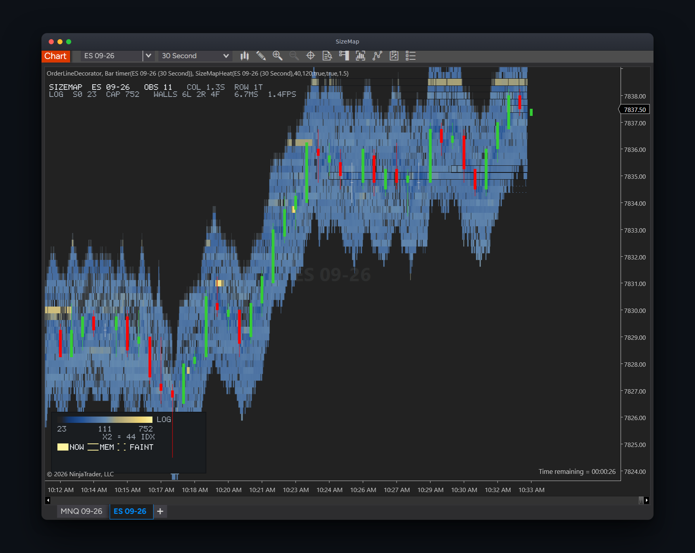
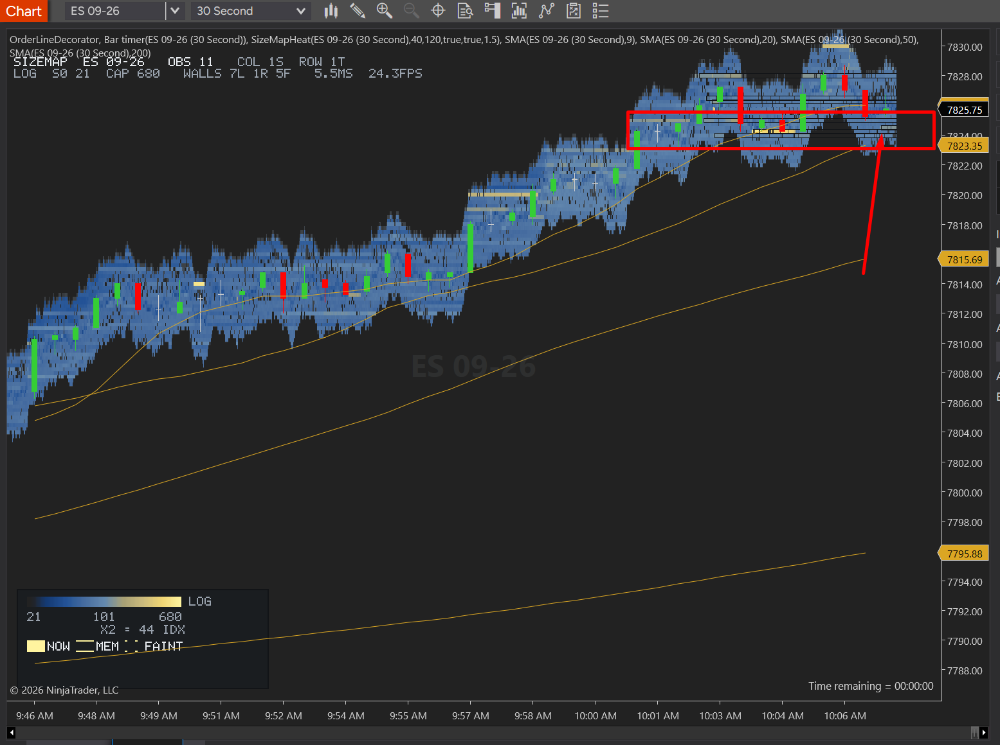
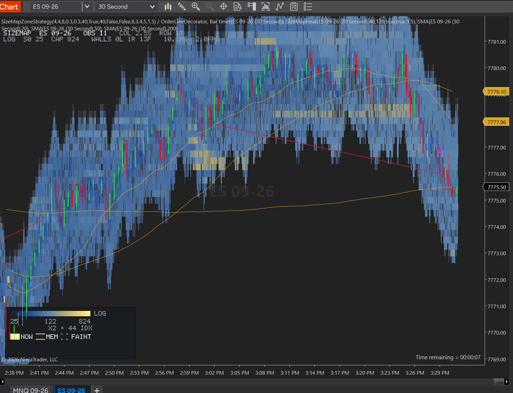

<div align="center">

<h1>SizeMap</h1>

<p>
  <b>An order-book depth heatmap for NinjaTrader 8, and an honest account of what it did and did not find.</b><br>
  Bookmap-style resting liquidity drawn behind your bars — plus the measurement that explains why most<br>"the wall disappeared" readings on a 10-level feed are not walls disappearing.
</p>

<p>
  <a href="#the-result">The result</a> ·
  <a href="#reading-the-heatmap">Reading the heatmap</a> ·
  <a href="#what-40-levels-buys-you">40 levels</a> ·
  <a href="#the-strategy">The strategy</a> ·
  <a href="#install">Install</a> ·
  <a href="#limits">Limits</a>
</p>

<p>
  
  
  
  
</p>



</div>

---

## The result

The heatmap works and is in daily discretionary use. **Three research hypotheses were tested
against recorded tape and all three came back negative**, and this README says so before it says
anything else.

The one thing that replicated is not an edge. It is a fact about the data:

| Finding | Value | Sample |
|---|---|---|
| "The wall vanished" that was really the 10-level window sliding | 85–92% | 5.8 M records, ES, recorded tape |
| Size still resting on those levels when they left the window | median 230 lots | same |
| Back inside the window within 1 s at ≥90% of the size they left with | 89–92% | same |
| `PULLED` classifications produced by the outcome classifier | 1 | 11,325 episodes |

The classifier could not tell a cancelled wall from a wall that scrolled out of view, because on a
10-level book **those two events look identical**: both report size 0 at that price. The feed does
distinguish them, and nobody was asking — a `Remove` at position 10 carries a non-zero size (the
window slid) while a `Remove` at positions 0–9 carries size 0 (the level emptied). The split was
100% clean in both directions across 79,188 far-end removals, and position 9 took 79,192 `Add`s
against them: one level in at the far end pushes one out. `BookMirror.IsWithinWindow` now exposes it.

What is *not* validated:

| Component | State |
|---|---|
| `SizeMapHeat` — the heatmap indicator | Working, in use |
| `SizeMapRecorder` — tape capture to `.smr` | Working, 5.8 M records captured |
| `verdict/` — offline replay + null-model harness | Working, reports in `docs/verdict/` |
| `SizeMapZoneStrategy` — the automated strategy | **Built, deployed, zero validated sessions** |

The strategy has never completed a validation run. Any number you might want from it does not exist yet.

---

## Reading the heatmap

Rows are price, columns are time, and colour is **how much size is resting at that price** —
log-scaled, because raw depth is dominated by a handful of large levels. Dark blue is thin, pale
gold is thick. The band travels with price because it is the depth window, not a fixed range.



Above, ES grinding up through 9:46–10:06. The **red box is drawn by hand**, not by the tool: it marks
a shelf of resting size that price traded into and stalled under. That is the read the heatmap is for
— seeing that the offer sitting above is thick *before* price gets there, rather than inferring it
from the bar that failed.

The HUD along the top is the diagnostic strip, and every field is there because it answers a
question you would otherwise have to guess at:

| Field | Meaning |
|---|---|
| `OBS 11` | Depth levels the feed is actually delivering. On NT Brokerage/Continuum this is ~10; on Rithmic it is 40+ |
| `CAP 752` | Top of the colour scale in lots — the value that renders as full gold right now |
| `WALLS 6L 2R 4F` | Confirmed walls: **L**ive in the window, **R**emembered outside it, **F**aint |
| `6.7MS 1.4FPS` | Render cost and repaint rate. NT8 caps chart repaints at 250 ms, so ~4 fps is the ceiling, not a bug |

The key in the bottom-left gives the scale for the visible window — minimum, midpoint and maximum
lots — plus what the three mark styles mean: `NOW` is live depth, `MEM` is a level being tracked
from memory after it left the window, `FAINT` is a level below the confidence floor.

---

## What 40 levels buys you

Everything above is a consequence of a **10-level window**. On ES at one level per tick, ten levels
reach 9 ticks — about 2.25 points. Any resting size beyond that is invisible, and when price moves
toward it the level scrolls out and reports as gone.

Rithmic delivers 40+. The far end moves from ~2.25 points to ~10, which changes three things:

- The shelf you want to trade into is usually **inside** the window instead of remembered from up to
  300 s ago, so `in_window` stops being the dominant caveat on every reading.
- A "wall vanished" event becomes far more likely to be a real cancellation, which is what the
  outcome classifier needed and never had.
- The heatmap stops being a thin ribbon and starts showing structure above and below the action.

Nothing in the code hardcodes ten levels — `BookMirror` reads the ladder's own extent, and
`WindowVisibilityTests` pins that the visibility predicate widens with the feed.

---

## The strategy



`SizeMapZoneStrategy` trades the zones the engine finds, and is **unvalidated**. It is included
because the CSV it writes is the only validation path that can ever exist for it (see Limits).

- **Zone** — a level the engine confirmed as a wall, that price then departed by ≥ 8 ticks and
  returned to within 4.
- **Trend** — SMA 20/50/200 stacked in the direction of the trade.
- **Range filter** — Kaufman efficiency ratio over 40 bars must clear 0.30. Net displacement divided
  by the path walked to get there: a straight line scores 1, a round trip scores 0. Added because
  the SMA stack orders itself cleanly at the *extremes* of a range, which is the worst place a
  continuation entry can be. The most trend-like 40-bar window inside the hour of ES chop that
  motivated the filter scores 0.12; a three-up-one-back leg scores 0.49. **0.30 is a guess**, which
  is why every row logs its own ratio.
- **Entry** — limit at the zone price, 4 contracts.
- **Exits** — 8-tick stop; targets at 3R / 4R / 5R; the fourth contract runs, trailed to 8 ticks
  beyond the next qualifying zone in its favour.

Every leg writes a row to `Documents\NinjaTrader 8\SizeMap\zone-decisions-<instrument>-<date>.csv`
carrying the zone's size, age, confidence and whether it was still in the depth window at the touch
— so a losing trade can be split into "the wall was there and I was adverse-selected" and "the wall
had been gone for four minutes".

---

## Install

Requires NinjaTrader 8 and a data feed with market depth.

```
nt8/SizeMapHeat.cs         ->  Documents\NinjaTrader 8\bin\Custom\Indicators\SizeMap\
nt8/SizeMapRecorder.cs     ->  Documents\NinjaTrader 8\bin\Custom\Indicators\SizeMap\
nt8/SizeMapProbe.cs        ->  Documents\NinjaTrader 8\bin\Custom\Indicators\SizeMap\
engine/*.cs                ->  Documents\NinjaTrader 8\bin\Custom\Indicators\SizeMap\
nt8/SizeMapNullStyle.cs    ->  Documents\NinjaTrader 8\bin\Custom\ChartStyles\
nt8/SizeMapZoneStrategy.cs ->  Documents\NinjaTrader 8\bin\Custom\Strategies\
```

The destination is decided by each file's `namespace`, not by what the file does — `scripts/deploy.sh`
routes on that and verifies each copy with `cmp`. Then compile in the NinjaScript editor (F5).

`scripts/gate.sh` compiles the repo against NT8's real reference set before you open the platform.
Do not use `nt8c check` on these files: it compiles one file at a time and `nt8/` references
`engine/`, so it reports about fifty false `CS0246` on every edit.

Add **SizeMapHeat** to a chart. It draws behind the bars via `SetZOrder(-1)`; select the
**SizeMap Null (no bars)** chart style if you want the heatmap without candles on top of it.

---

## Limits

- **It cannot be backtested.** `OnMarketDepth` never fires on historical bars, so the heatmap is
  blank and the strategy never arms. Market Replay or a live/Sim connection only.
- **No MBO in NinjaScript.** Market-by-order is not exposed to NinjaScript at all (NinjaTrader
  feature request SFT-1496), so queue position is invisible and nothing here can tell you where in
  the queue your order sits.
- **The depth window is whatever your feed sends.** On a 10-level feed most of what looks like
  liquidity vanishing is the window moving — the top of this README exists to keep that in front of you.
- **The strategy is unvalidated and the three research hypotheses came back negative.** Treat the
  heatmap as a discretionary instrument and the strategy as an experiment.
- Not financial advice.

---

## License

Not set yet.
